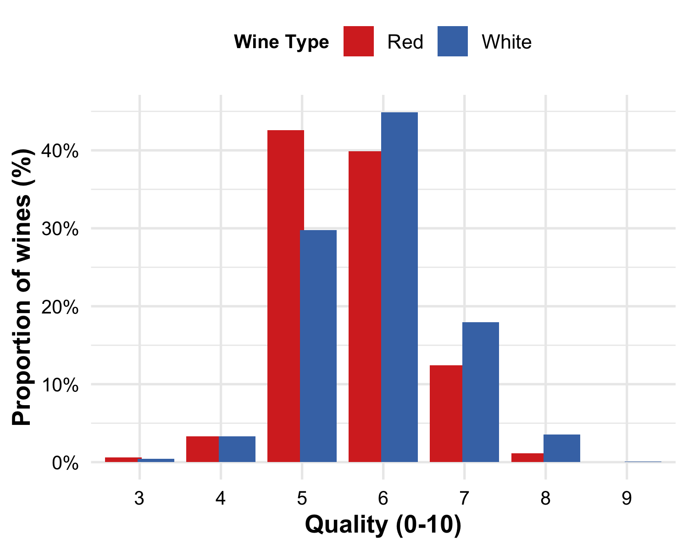
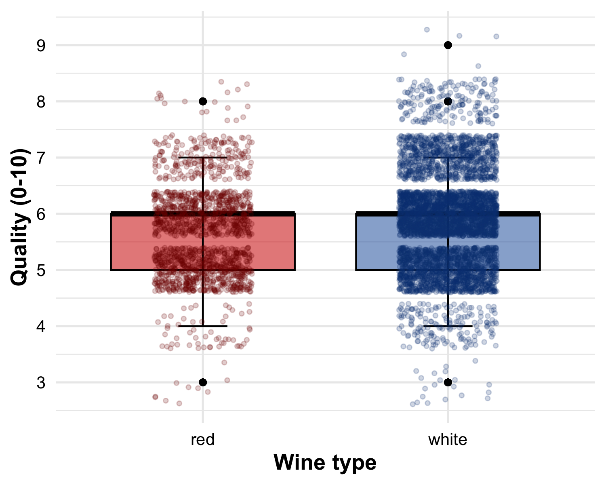
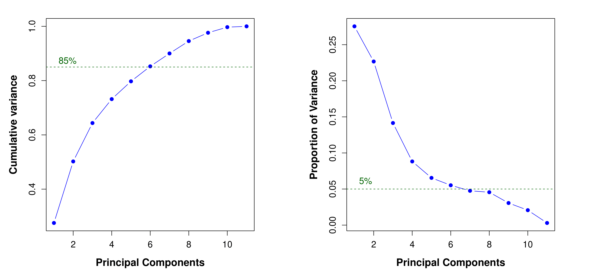
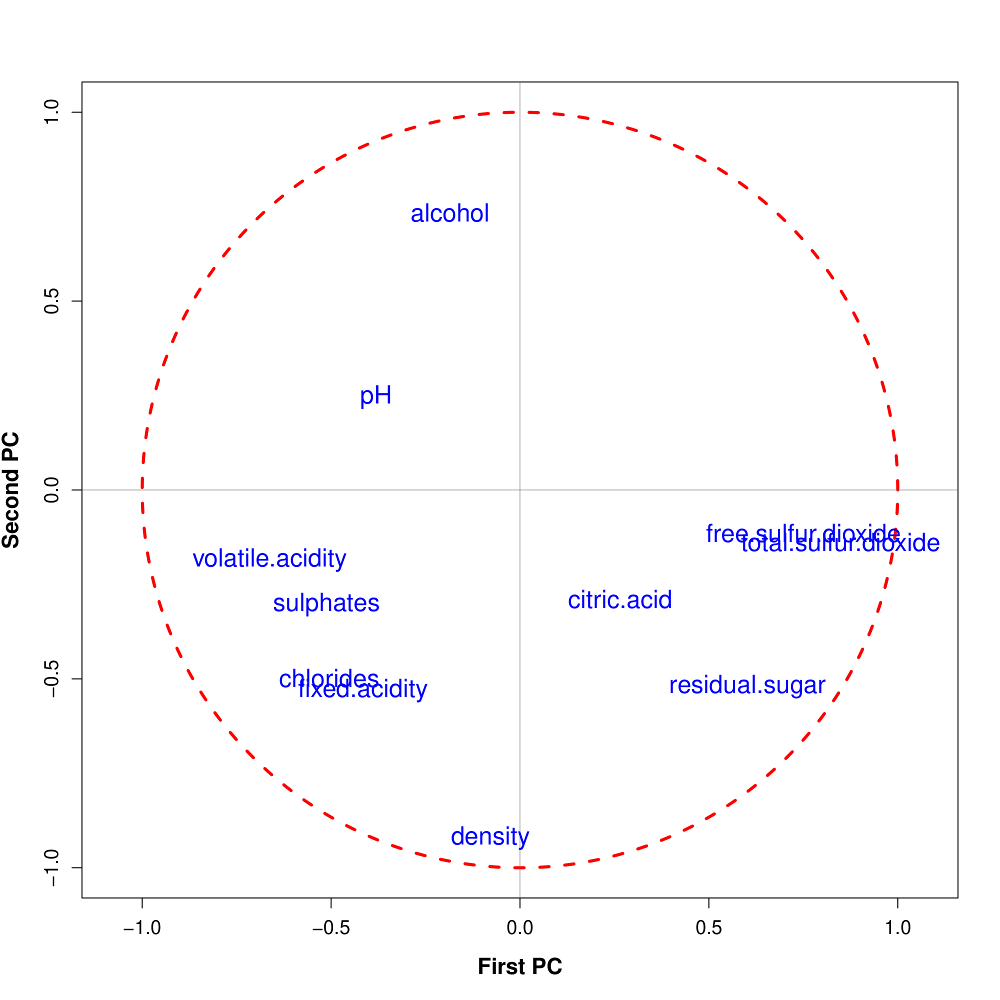
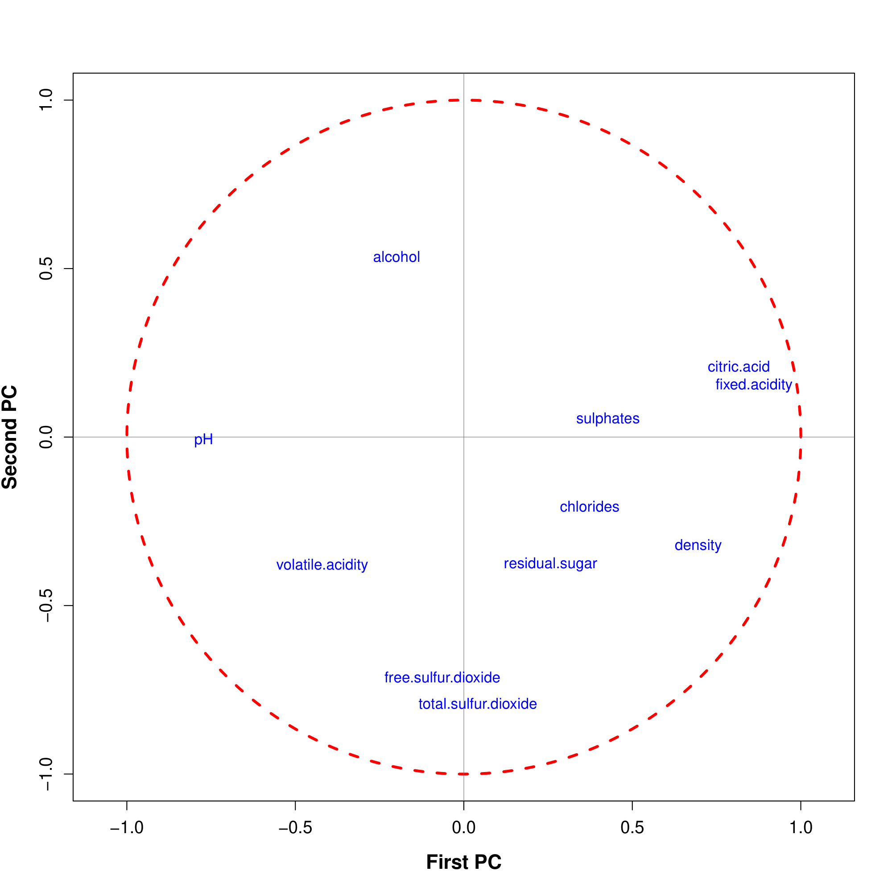
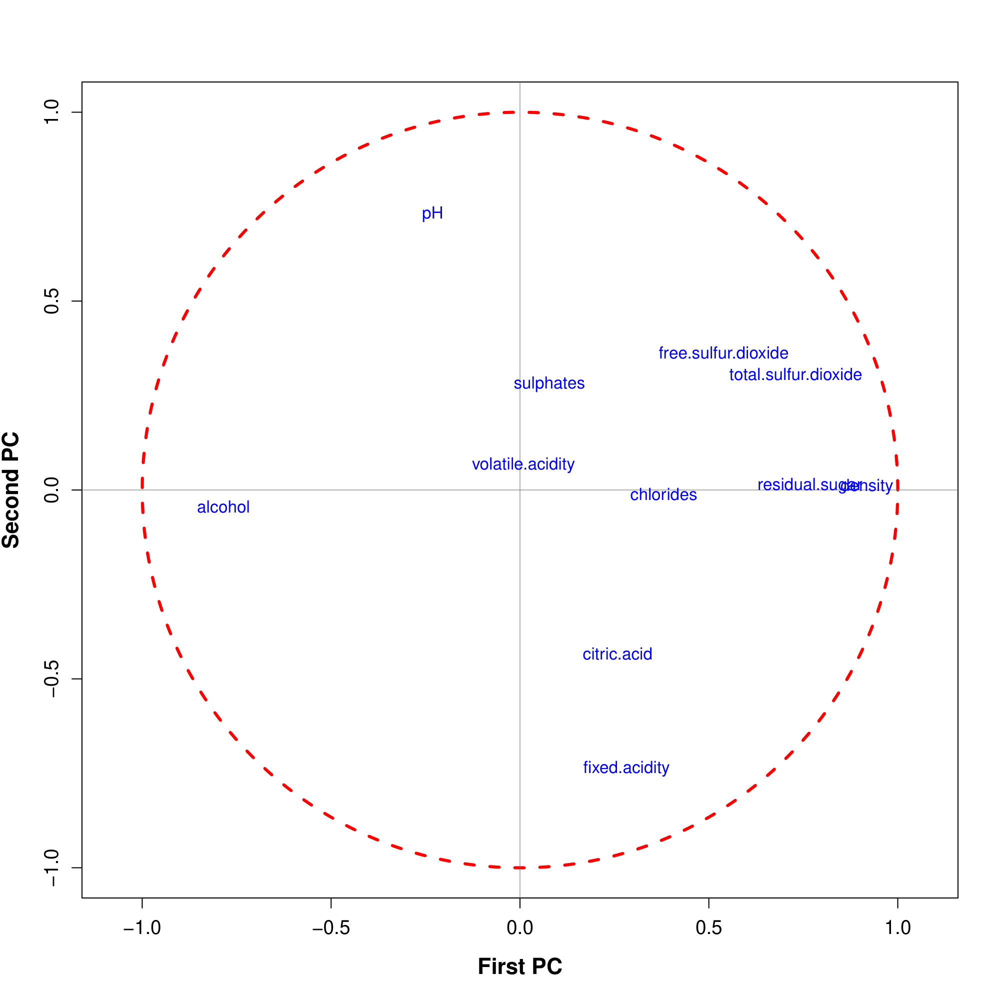
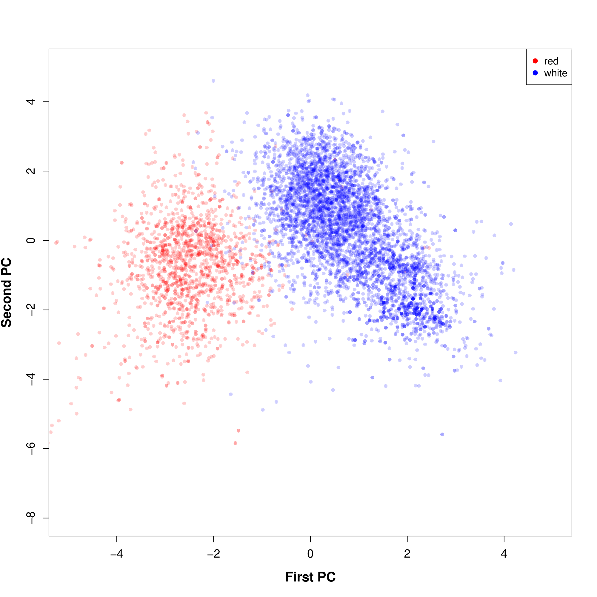
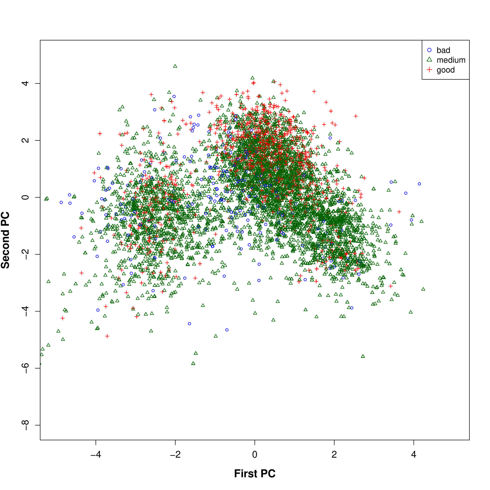
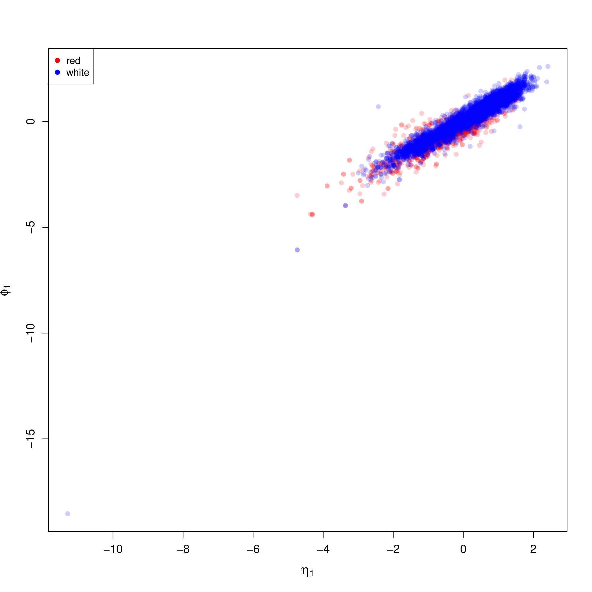

# 🍷 Wine quality analysis: data science & multivariate statistics

An applied multivariate statistical analysis of **6,497 wine samples** (1,599 red and 4,898 white variants) of wine. The study investigates physicochemical properties (acidity, residual sugar, chlorides, sulfur dioxide, density, pH, sulfates, alcohol) to uncover latent structural differences between wine types and evaluate feature contributions to sensory quality ratings.

## Key methodologies

* **Exploratory data analysis**: Quantitative comparison of feature distributions across red and white wines using normalized difference of means:
  $$\Delta = \frac{\mu_{\text{white}} - \mu_{\text{red}}}{\text{SD}_{\text{pooled}}}$$
* **Principal component analysis (PCA)**: Unsupervised dimensionality reduction, Scree Plot variance decomposition (selecting components explaining $>85\%$ variance), correlation circles (PC1 vs PC2 loading system), and observation projections.
* **Factor analysis (FA)**: Maximum Likelihood factor extraction and Varimax orthogonal rotation to identify underlying latent factors.
* **Canonical correlation analysis (CCA)**: Assessing canonical correlation relationships between chemical compositions and physical characteristics.

## Results & statistical analysis

### Wine quality distributions
Both red and white wines share the same median quality score of **6**. However, white wine displays higher variability with a greater proportion of high quality scores ($\ge 6$), whereas red wine contains a higher percentage of lower quality scores ($\le 5$).

### Principal component analysis (PCA) & selection
* **Variance explained:** The first **6 principal components (PCs)** explain approximately **85% of the total variance**, while the 7th PC accounts for less than 5%.

* **PC1 (processing & naturalness):** Primarily driven by sulfur dioxides (`total.sulfur.dioxide`, `free.sulfur.dioxide`) and `volatile.acidity`. Free and total $SO_2$ strongly correlate with each other and `residual.sugar`, but negatively correlate with `volatile.acidity`.
* **PC2 (fullness of taste & strength):** Governed by `density` and `alcohol`, which exhibit a strong inverse relationship.

* **Red wines:** Feature a strong alignment of `citric.acid`, `fixed.acidity`, and `pH` along PC1, underscoring their critical role in the red wine flavor profile.
* **White wines:** Display a distinct `alcohol`-`density`-`residual.sugar` pattern along PC2, reflecting the balance between sweetness and freshness.

* **Wine type separation:** The first two principal components clearly separate red and white wines into two distinct clusters along PC1 due to sulfur dioxide and acidity differences.
* **Quality separation:** In contrast, sensory quality ratings (even when grouped into *bad*, *medium*, and *good* categories) cannot be linearly separated within the PC1–PC2 coordinate space.

### Canonical correlation analysis
Canonical correlation analysis (CCA) was conducted to link production variables $X$ (`fixed.acidity`, `volatile.acidity`, `citric.acid`, `residual.sugar`, `chlorides`, `free.sulfur.dioxide`, `total.sulfur.dioxide`) with physical property variables $Y$ (`density`, `pH`, `sulphates`, `alcohol`).

* **First canonical correlation:** $\rho_1 = 0.9467$
* **Interpretation:** Uncovers a strong latent dimension bridging production inputs and measured physical properties, where higher acidity and $SO_2$ levels directly correlate with shifts in density, pH, sulphates, and alcohol content.

---

* **Author:** Daria Baranchikova
* **Institution:** Technische Universität Dresden (TU Dresden)
* **Course:** Applied Multivariate Statistics
* **Dataset source:** P. Cortez, A. Cerdeira, F. Almeida, T. Matos and J. Reis. Modeling wine preferences by data mining
from physicochemical properties. In Decision Support Systems, Elsevier, 47(4):547-553. ISSN: 0167-9236
